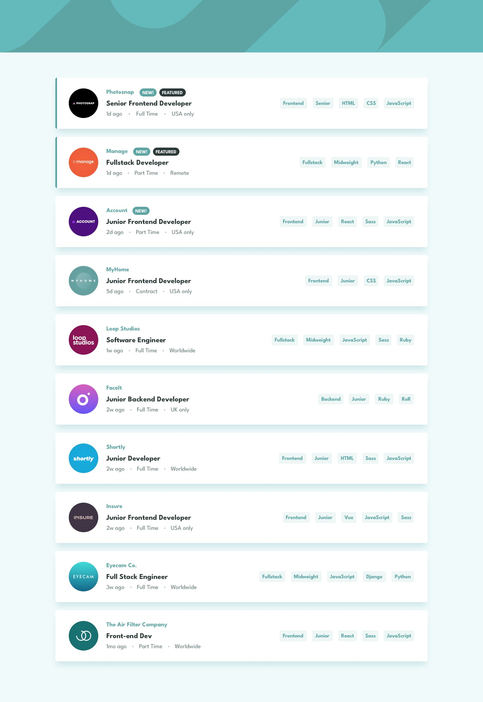
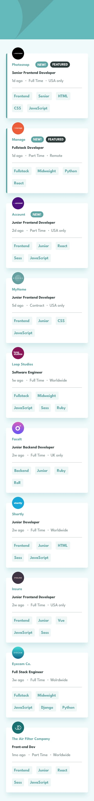
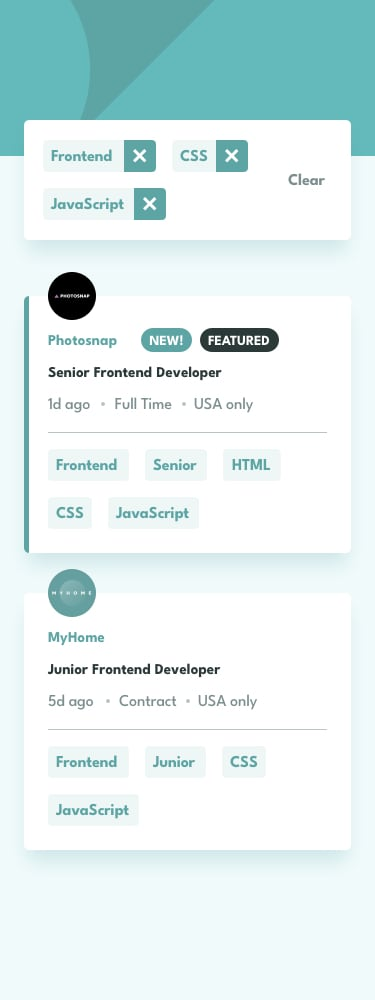

# Frontend Mentor - Job listings with filtering solution

This is a solution to the [Job listings with filtering challenge on Frontend Mentor](https://www.frontendmentor.io/challenges/job-listings-with-filtering-ivstIPCt). Frontend Mentor challenges help you improve your coding skills by building realistic projects.

## Table of contents

- [Overview](#overview)
  - [The challenge](#the-challenge)
  - [Screenshot](#screenshot)
  - [Links](#links)
- [My process](#my-process)
  - [Built with](#built-with)
  - [What I learned](#what-i-learned)
  - [Continued development](#continued-development)
- [Getting started](#getting-started)
- [Author](#author)

## Overview

### The challenge

Users should be able to:

- View the optimal layout for the site depending on their device's screen size
- See hover states for all interactive elements on the page
- Filter job listings based on the categories

When a user clicks a tag on a job listing (role, level, language, or tool), it is
added to a filter bar at the top of the listings. Multiple filters combine with
**AND** logic — only jobs matching _every_ selected tag remain visible. Individual
filters can be removed, or all of them cleared at once.

### Screenshot





### Links

- [Solution URL](https://www.frontendmentor.io/solutions/job-listings-with-filtering-react-19-typescript-and-tailwind-v4-fCwEE90cTp)
- [Live Site](https://euphonious-smakager-6b27d9.netlify.app/)

## My process

### Built with

- [React 19](https://react.dev/) — UI library
- [TypeScript](https://www.typescriptlang.org/) — typed component props and job data
- [Vite](https://vite.dev/) — build tool and dev server
- [Tailwind CSS v4](https://tailwindcss.com/) — utility-first styling with theme tokens
- [League Spartan](https://fontsource.org/fonts/league-spartan) via Fontsource
- Semantic HTML5 markup
- Mobile-first, responsive workflow (Flexbox & CSS Grid)
- Accessibility-minded: live region for result counts, `sr-only` headings, descriptive `aria-label`s, and a responsive `<picture>` header

### Project structure

```
src/
├── App.tsx                       # owns filter state and the visible-jobs derivation
├── data/data.ts                  # job listings, typed with `satisfies Job[]`
├── types/job.ts                  # the Job type
├── utils/getJobTags.ts           # flattens role/level/languages/tools into one tag list
└── components/
    ├── jobcard/JobCard.tsx       # single listing; tag buttons emit filter clicks
    └── filterbar/FilterBar.tsx   # active filters with remove/clear controls
```

### What I learned

State for the active filters is held as a `Set<string>` in `App`, which keeps tags
unique and makes add/remove/clear operations clean. The visible list is _derived_
from that state on each render rather than stored separately:

```tsx
const visibleJobs = jobs.filter((job) => {
  const tags = getJobTags(job);
  return [...activeFilters].every((filter) => tags.includes(filter));
});
```

A single `getJobTags` helper is the source of truth for what counts as a tag, so
the card buttons and the filter-matching logic can never drift apart.

## Getting started

Requires [Node.js](https://nodejs.org/) and npm.

```bash
# install dependencies
npm install

# start the dev server
npm run dev

# type-check and build for production
npm run build

# preview the production build
npm run preview

# lint
npm run lint
```

## Author

- Frontend Mentor - [@dev-rome](https://www.frontendmentor.io/profile/dev-rome)
- X - [@rome-dev](https://www.x.com/rome_dev)
- Linkedin - [Jerome-Haynes](https://www.linkedin.com/in/jerome-haynes/)
